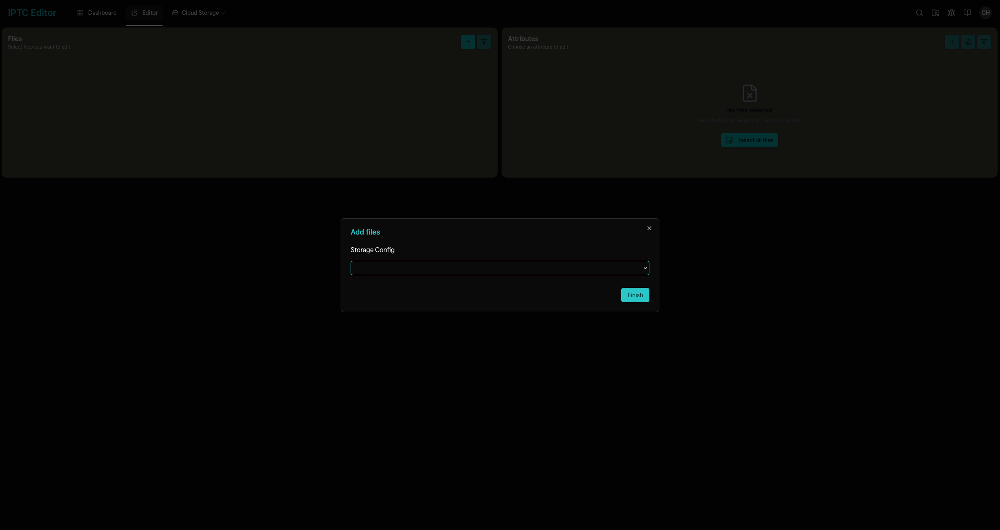
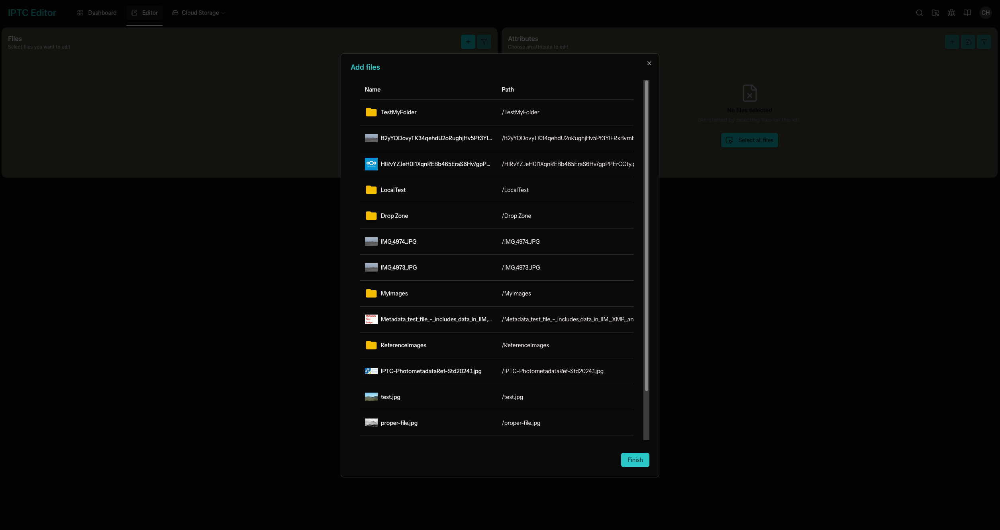
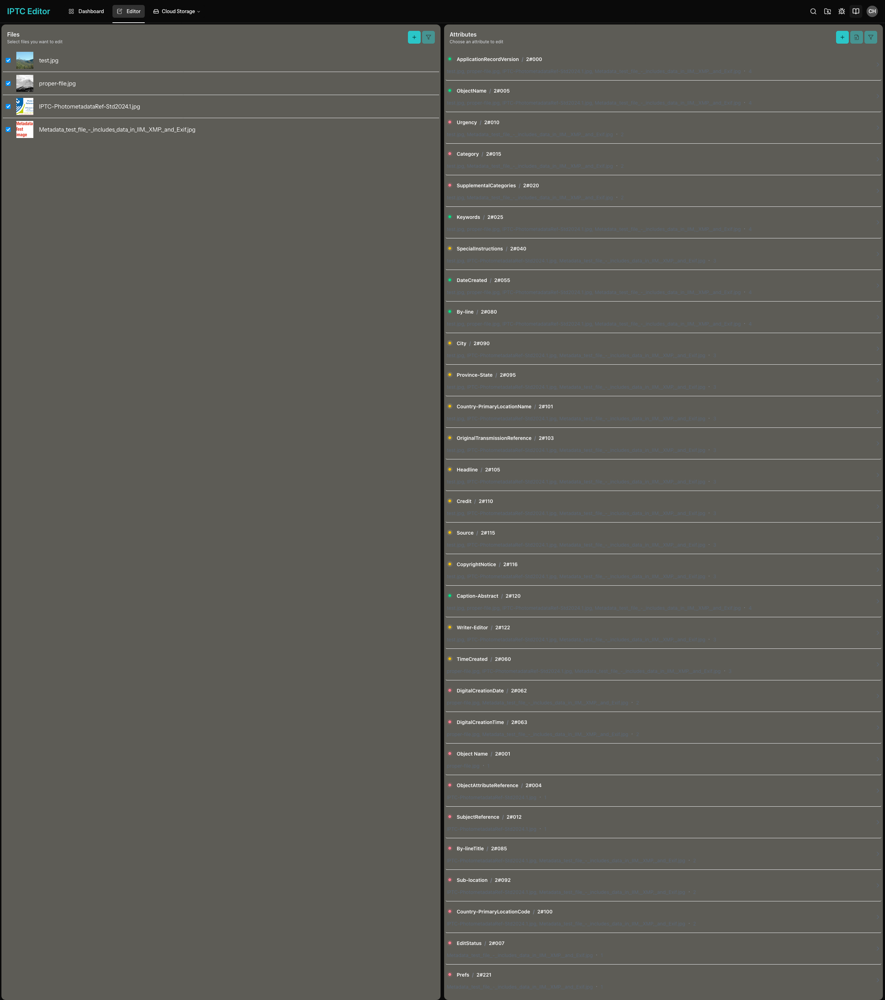
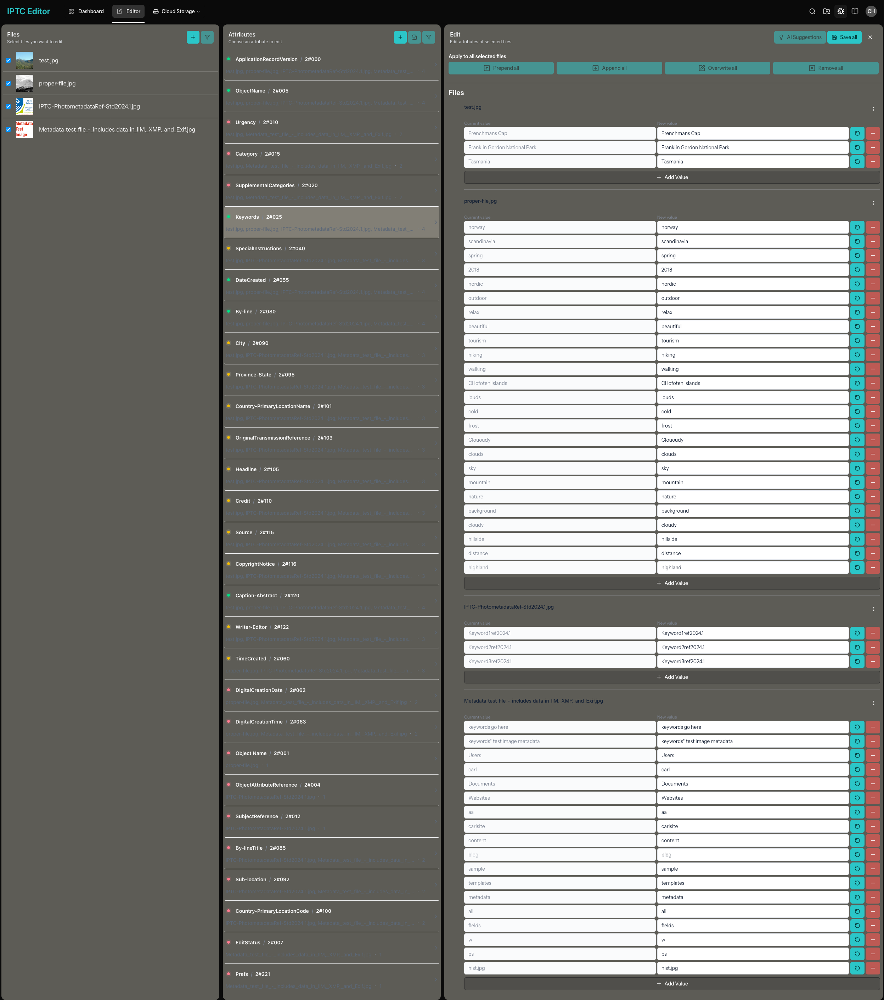
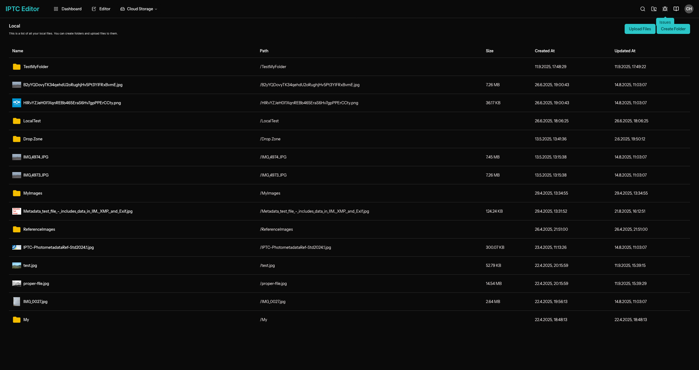
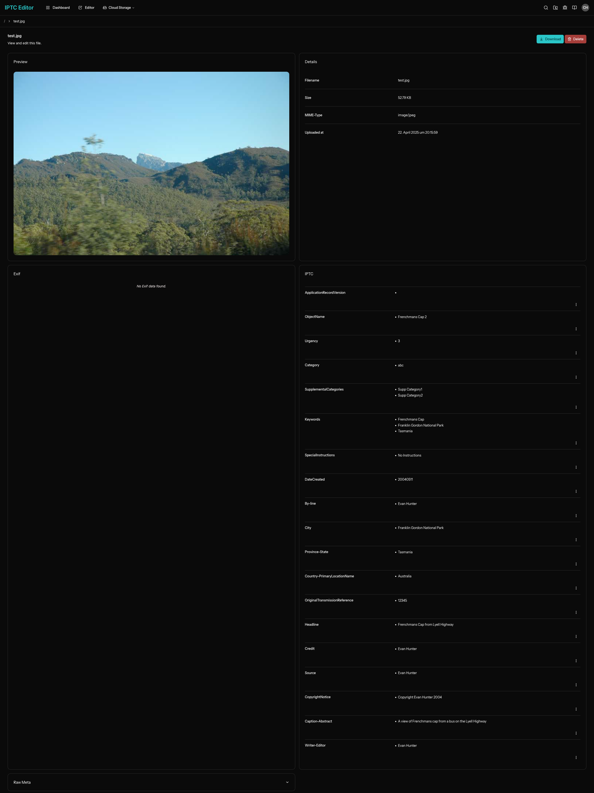
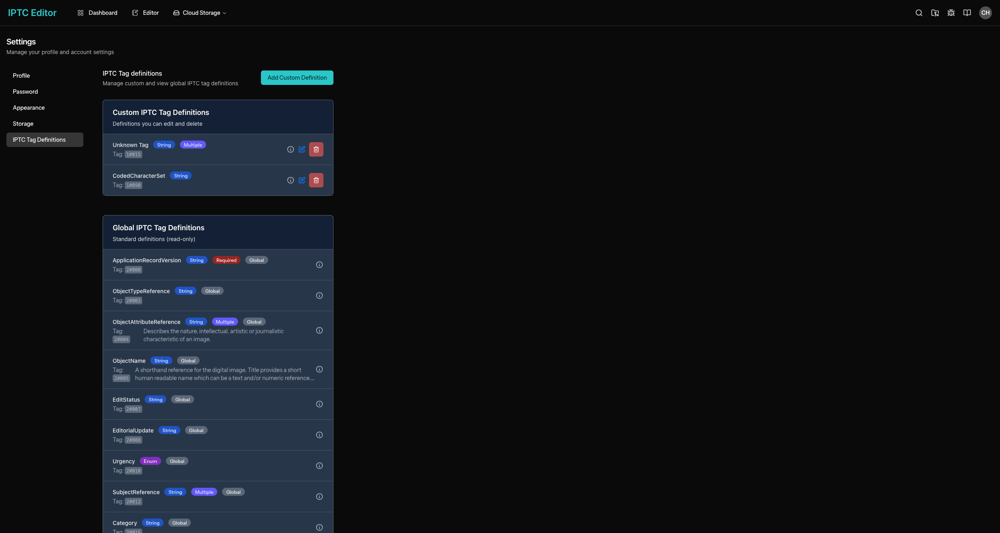
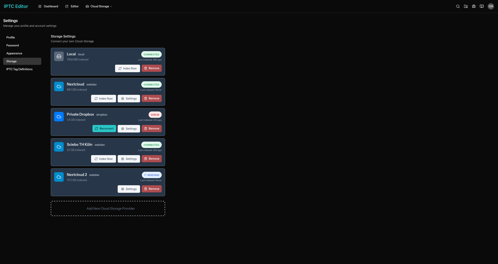
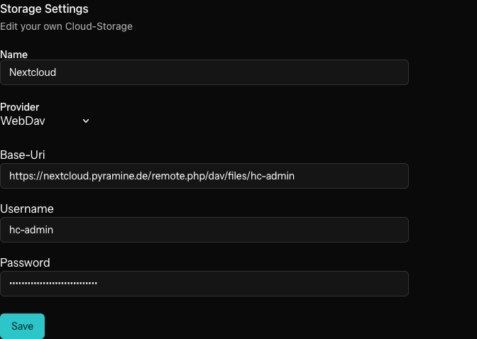

# Application Overview

This application is a web-based management tool built with PHP, Vue.js, and TypeScript. It provides a user-friendly interface for managing IPTC tag definitions, file storage, and related settings.

> AI generated documentation.

## Features

### 1. Editor Interface

The editor allows users to view and select files, folders, and storage options.

**Storage Selection:**  

**File Selection:**  

**Selected Files:**  

**Editor Main View:**  

### 2. Storage Management

Manage files and folders within different storage backends, including WebDAV.

**Folder View:**  

**File View:**  

### 3. IPTC Tag Definitions

Configure and review IPTC tag definitions, including their data types, length ranges, and enum values.

**IPTC Tag Definitions Settings:**  

### 4. General Settings

Adjust storage and tag definition settings from the settings panel.

**Storage Settings:**  

**WebDAV Settings:**  

---

## Technologies Used

- **PHP** (backend)
- **Vue.js** (frontend)
- **TypeScript** & **JavaScript**
- **Composer** & **npm** for dependency management
